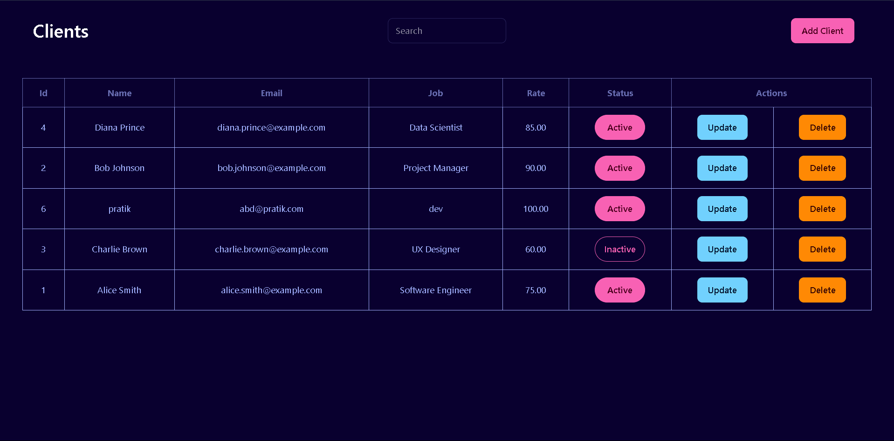
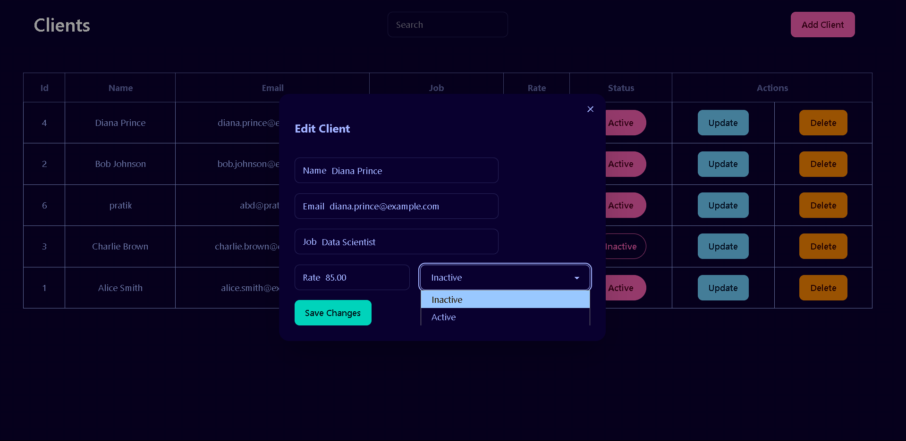

<h1 align="center">PostgreSql CRUD APP </h1>
<div align="center">
  
  
  
</div>

<p> A full-stack CRUD application using PostgreSQL, Express.js (Node.js), and React (Vite) with Tailwind CSS & DaisyUi for styling.</p>

## Features

- **Backend:** Node.js, Express, PostgreSQL
- **Frontend:** React (Vite), Tailwind CSS, DaisyUI
- **CRUD Operations:** Create, Read, Update, Delete clients
- **Responsive UI:** Mobile-friendly table layout
- **Environment Variables:** Managed via `.env` file

## UI Preview

### 🏠 Homepage


### 🧑‍💼 Add Client


### 🧑‍💼 Update Client



### Prerequisites

- Node.js (v18+ recommended)
- PostgreSQL

## Project Structure

```
PgSql-crud-app/
├── backend/
│   ├── src/
│   │   ├── db.js
│   │   └── index.js
│   └── .env
├── frontend/
│   ├── src/
│   │   └── components/
│   │       └── TableList.jsx
│   └── package.json
└── README.md
```

## Technologies

- Node.js
- Express.js
- PostgreSQL
- React
- Vite
- Tailwind CSS
- DaisyUI

## created this repo for learning purposes only.
